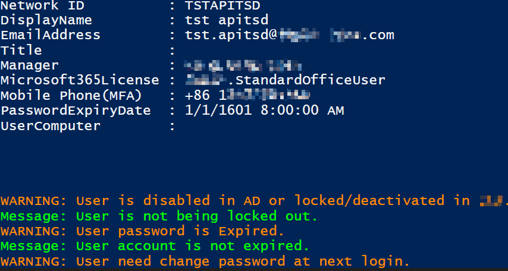

# <center>AD User Management Tool


**What can it do?**

1. View user basic info（**Uer Computer**, Office，Manager，**Account lock**, Password Expired）
2. View user detail info（**Office Language**, **Password Last Set Time**, **Manager Email,** **U Drive**）
3. View user access（**VPN**）
4. Enable user in AD
5. Reset password
6. Disable password expiry
7. Unlock Account
8. Change Office Language

**Example:**



## 1. How to use

Right click->Run with Powershell


## 2. Supported User ID Type

Currently this script support below search condition:

- Network Id 
- uid (firstname.lastname)
- Email Address
- Display Name


## 3. How to switch easy/complicated password

Change below line to `$true` or `$false` under **variables** block

```powershell
[Bool]$EasyPasswordEnabled = $true
```

Default value is set to keep on **$true**


## 4. QA

1. **When should I use 'Enable User in AD'?**

   When a account is active in CDS but disable in AD, we can use this feature to quickly activate user in AD.

   > This option will not work if this account is not in **Graveyard**(Deleted in AD 30 days ago)

2. **When should I use 'disable password at first logon'?**

   After user password reset, user still get 'change password prompt' every time, use this feature to disable password reset prompt.

3. **When should I use 'Unlock account'**

   When user unable to login and shows account is locked out, you may use this feature to unlock in AD directly.

4. **Why I changed Office web language but it is not take effect?**

   After changing language in AD, you can search this user to refresh the result and see current setting by option Option 2 `view detail information` -> `preferredLanguage`, it should be changed. In web please wait up to **24 hours** to make this sync take effect. 

## Update History

        v0.1.0 =  Initial version.
        v0.1.1 =  Add feature to reset user password.
        v0.1.2 =  Check/Confirm window will pop up before action.
                  Modified menu layout.
        v0.1.4 =  Add feature to get IMU application access.
                  Show selected user above selection line.
                  Optimized menu function.
        v0.1.5 =  Application access result now include IMU user profile.
        v0.1.6 =  Add feature to enable ad user.
                  Highlighted id and other important message.
        v0.1.7 =  When search user, the manager will display normally.
        v0.1.8 =  When search returns multiple user, you can specify a user to proceed.
                  Remove previous selected user and history when run this script.
                  Removed GST user from search result.
                  Add OU into user detail information.
                  Optimized tip message.
        v0.1.9 =  Now you can search a user in main menu directly.
        v0.2.0 =  Add switch for GST account search.
                  Add change language feature for Office 365 Webpage
        v0.2.1 =  Indented code to improve readability.
                  Add back gst account search with Network id or uid. also password reset.
        v0.2.2 =  Password now will have random words from a list.
        v0.2.3 =  Removed mobile and telephone number from result.
                  Add feature to search with Email Address.
                  Add some name for Get-AdUser result filter.
        v0.2.4 =  Add Manager Email in detail information.
                  Removed language change feature, add disable password change after logon.
        v0.2.5 =  Add CDS user group information, changed layout.
        v0.2.6 =  Highlight VPN access.
                  Add O365 License into brief info.
        v0.2.7 =  Add Update History into main menu.
        v0.2.8 =  Add Password Expiry date and Password Expire Alert.
        v0.2.9 =  Fixed VPN access shows wrong result, changed menu option.
        v0.3.0 =  Fixed bug unable to enable AD User.
                  Modified multiple color output code.
        v0.3.1 =  Chnaged default color to ui default color.
        v0.3.2 =  Fixed a bug to display color.
        v0.3.3 =  Fixed a bug with color display.
                  Fixed a bug with enable AD Account, result changes after enable done.
                  changed prompt confirm message.
        v0.3.4 =  Fixed bug when with id selection.
                  Fixed a bug when go to option 1, the no user match message returned wrong result.
        v0.3.5 =  Add feature to change user AD language.
        v0.3.6 =  Optimized language change message.
        v0.3.7 =  Optimized message showing in wrong position.
        v0.3.8 =  Text modification.
                  Fixed a bug in password.
                  Modified the count method of gst account.
                  Enhanced password complexity with new AD password policy.
        v0.3.9 =  Reduce password complexity for regular accounts.
        v0.4.0 =  Changed Script Name to from 'Get ADUser Tool' to 'AD User Management Tool for ITSD'.
                  Add Version Number in Menu Title.
                  Modified Update Log Display.
        v0.4.1 =  Add User Computer in main menu.
        v0.4.2 =  More words in password dictionary.
                  Fixed bug about cannot disable password change after logon.
        v0.4.3 =  Add feature to unlock AD Account.
        v0.4.4 =  Modified syntax.
                  Highlighted MFA Phone.
        v0.4.5 =  Fixed version display bug.
        v0.4.6 =  Display MFA Phone on search result page.
        v0.4.7 =  Modified prompt code.
        v0.4.8 =  Added detection of AD Module
                  Modified code, enhanced performance and stability.
        v0.4.9 =  Add feature of password expired alert.
                  Fixed a bug in version display.
        v0.5.0 =  Fixed a bug of password reset.
                  Fixed a bug of prompt confirm.
        v0.5.1 =  Modified feature of enable ad user.
                  Modified code with search result.
        v0.5.2 =  Modified some code.
                  Add more words in password dictionary.
                  Fixed a bug in enable AD user.
        v0.5.3 =  Fixed a bug in enable AD user,
                  Add Easy Password switch.
        v0.5.4 =  Fixed a bug of password expiry alert.
                  change easy password to default, if need more complexed password, please change `$EasyPasswordEnabled to `$false.
        v0.5.5 =  Modified Code with app access filter.
        v0.5.6 =  Removed duplicate password expiry alert.
                  Fixed a bug in disable change user password.
                  Text modification.
        v0.5.7 =  Changed version ID, now started with 0.1
                  Modify version check function.
        v0.5.8 =  Fixed a bug when search user.
        v0.5.9 =  Fixed a bug which cannot find correct Computer Name.
        v0.6.0 =  Fixed a bug of detect user selection.
                  Text modification.
        v0.6.1 =  Fixed a bug of display user computer.
        v0.6.2 =  Added a feature to display account expiry.
                  Fixed a bug of display user computer. 
        v0.6.3 =  Added a feature to send data to collect usage.
        v0.6.4 =  Modified Code.
                  Fixed wrong error message.
        v0.6.5 =  Fixed a bug in enable AD User.
        v0.6.6 =  Add a feature to exclude service account from password reset.
        v0.6.7 =  Modified text in change Office language.
        v0.6.8 =  Modified layout, added account locked out alert.
        v0.6.9 =  Fixed a bug that did not recognize AD lock successfully in specific situation.
        v0.7.0 =  Fixed a bug in password reset.
        v0.7.1 =  Added a feature to distinguish User temporarily lock out and manualy lock out.
        v0.7.2 =  Fixed a bug when reset password for anonymous account.
                  Fixed a bug that unable to quit with Q keyword.
                  Text modification.
        v0.7.3 =  Highlighted VPN access group.
                  Text modification.
                  Now it can display multiple VPN access.
    	v0.7.4 =  Modified layout when display multiple VPN access.
    	v0.7.5 =  Added PAM accounts reset notification.

